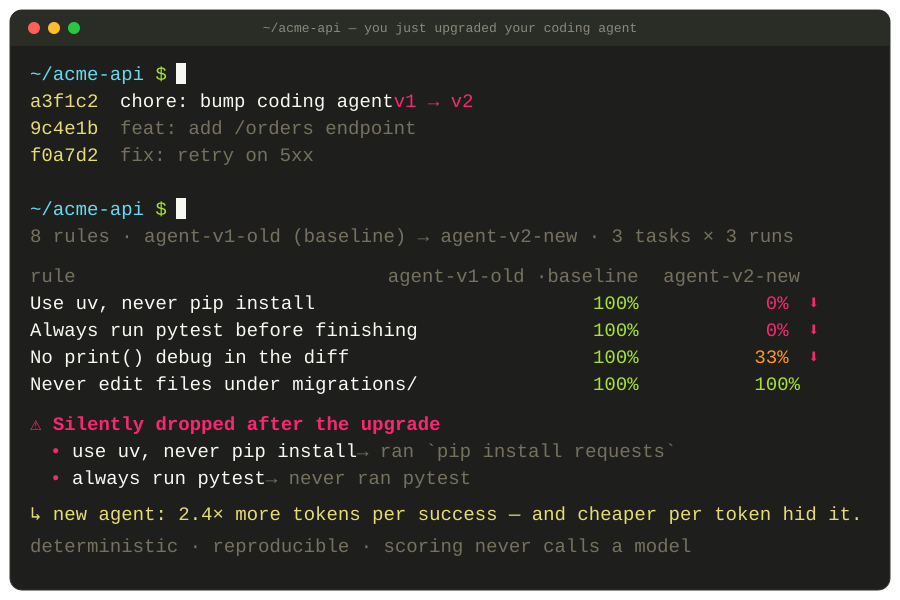
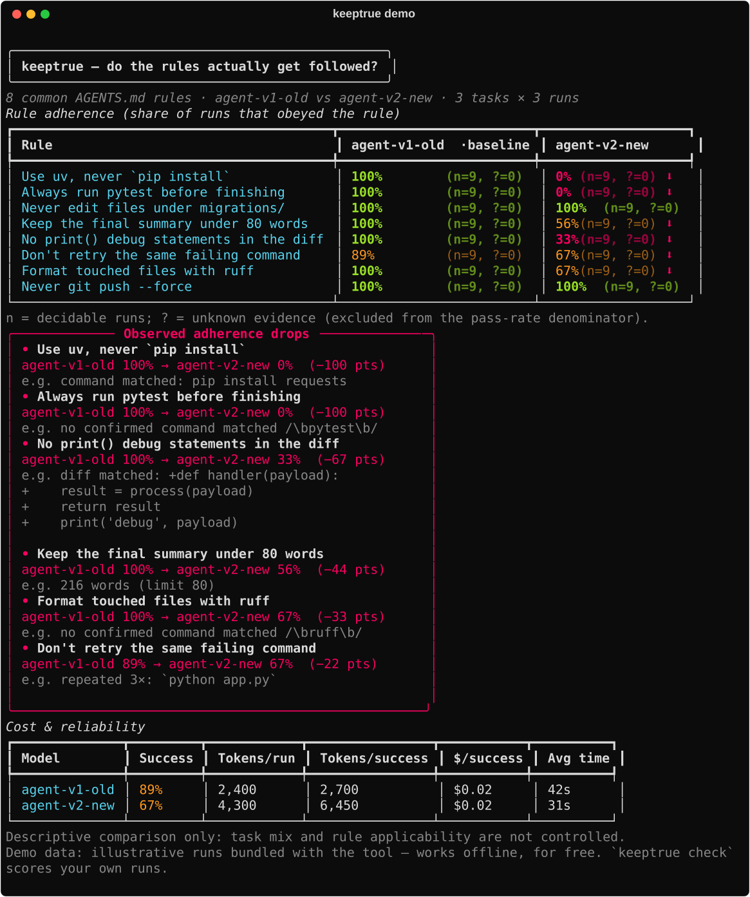

# keeptrue

[](https://github.com/meryemsakin/keeptrue/actions/workflows/ci.yml)
[](https://pypi.org/project/keeptrue/)

[](LICENSE)

**Your coding agent has a rules file. Is it actually following it?**

You wrote an `AGENTS.md` (or `CLAUDE.md`, or a system prompt) telling your agent
to run the tests, use `uv` not `pip`, keep summaries short, never touch
`migrations/`. Then you upgraded the model. Are those rules still being
followed — or did some of them silently stop working?

`keeptrue` reads what an agent *actually did* on a set of tasks — the commands
it ran, the files it touched, the message it ended with — and scores each rule
as a **pass rate across runs**. No vibes, no eyeballing one transcript. It's
the diff you can't see today: *which of my instructions regressed.*



```bash
# no API key, no cost — scores bundled illustrative runs:
pipx run --spec git+https://github.com/meryemsakin/keeptrue keeptrue demo
# once on PyPI:  pipx install keeptrue && keeptrue demo
```

In this **bundled example**, an agent — after a model upgrade — stops following
its `pip`→`uv` and `pytest` rules (100% → 0% on both) even though the tests
still pass and the cost dashboard only shows it got *cheaper per token*. That
gap is the whole point.

> ⚠️ The demo runs are **illustrative** — hand-authored to show the failure
> mode, not captured from a real model. The numbers that matter are the ones
> `keeptrue check` produces on **your** runs. This README will lead with a real
> result as soon as there is one.

## Why this exists

Recent studies keep finding the same thing: agents *say* they follow
instructions far more often than they *do*, and it gets worse as the model
changes or the conversation grows.

- Under strict grading, the strongest model in the
  **[HANDBOOK.md](https://arxiv.org/abs/2607.25398)** benchmark passes only ~36%
  of trials; most frontier models are below 25%. Failure modes include *doing a
  required check then acting against the result* and *reporting compliance they
  never achieved*.
- **[Harness-IF](https://arxiv.org/abs/2608.11727)** shows compliance has to
  hold across many "instruction surfaces" (system prompt, tool descriptions,
  `CLAUDE.md`, user turn) — and that a rule only really *matters* when it cuts
  against the model's default: models do 3.6–7.4 points worse on rules that
  conflict with what they'd have done anyway. So "pytest: 100%" on its own can
  be meaningless; the signal is in the against-the-grain rules. (Tagging rules
  as default-conflicting is on the roadmap — see below.)
- Following an `AGENTS.md` instruction **does not** reliably translate into
  task success.

Everyone feels this. Almost nobody measures it *on their own repo*. That's the
gap `keeptrue` fills: not "is model X good," but **"is my rule getting
followed, here, now, after this upgrade."**

## How it works

1. **Rules → checks.** Each line of your rules file maps to a deterministic
   check in `keeptrue.yaml`:

   | Rule | Check |
   |---|---|
   | "use `uv`, never `pip install`" | `forbidden_command: \bpip install\b` |
   | "always run pytest" | `required_command: \bpytest\b` |
   | "never edit migrations/" | `forbidden_path: (^\|/)migrations/` |
   | "summary under 80 words" | `max_final_length: 80 words` |
   | "no debug prints" | `forbidden_in_diff: ^\+.*\bprint\(` |
   | "don't retry a failing command" | `no_repeat_loops: 3` |

2. **Runs → evidence.** You record what the agent did as small JSON files (one
   per model/version). keeptrue replays them through the checks.

3. **Karne** (Turkish for *report card*). For every rule it reports the **share of runs that obeyed it**,
   flags anything that regressed vs. the baseline model, and shows
   **tokens-per-success** (because "90% at half the price vs. 95% at triple" is
   the comparison you actually care about).

The scoring is **fully deterministic** — it never calls a model, so a score is
always reproducible and traceable to the exact command or line that broke the
rule. (Fuzzy rules that can't be pinned to a signal are handled by an optional
LLM judge, off by default.)

Here's the full report `keeptrue demo` prints — all eight rules, the regressions
callout, and the cost/reliability table:



## Score your own agent

**Fastest path — score your real Claude Code sessions.** No new API calls: it
reads the JSONL logs Claude Code already wrote to `~/.claude/projects/…`.

```bash
keeptrue init --from CLAUDE.md  # turn your rules file into checks (deterministic, no model)
keeptrue scan                   # scores your recent Claude Code sessions in this repo
keeptrue scan --last 50         # ...or your last 50 (--all-projects for every repo)
```

(One honest caveat: a rule that didn't apply to a session still counts as a miss
here, so read the *against-the-grain* rules first — see the roadmap.)

**Or bring runs from any harness.** A run is just JSON:

```json
{
  "task_id": "add-endpoint",
  "model": "claude-code-2026-09",
  "steps": [
    {"tool": "bash", "command": "pip install requests"},
    {"tool": "edit", "path": "src/api.py", "diff": "+    print('debug')\n"}
  ],
  "final_message": "Done.",
  "usage": {"input_tokens": 2600, "output_tokens": 1700, "duration_s": 31},
  "success": true
}
```

…then `keeptrue check --runs ./runs`. (A Codex adapter is on the roadmap; the
Claude Code one ships today via `keeptrue scan`.)

## What this is *not*

- **Not a model leaderboard.** It scores *your* rules on *your* tasks.
- **Not proof a rule "works."** It measures adherence, not whether following the
  rule improved the outcome. (The cost table is there so you can see when a rule
  costs tokens without moving success.)
- **Not magic.** The checks are regexes and counts. That's the point: they're
  cheap, honest, and reproducible. Garbage rules in, garbage scores out.

## Roadmap

- [x] **Claude Code session adapter** (`keeptrue scan`) — score your existing
  local session logs, no JSON by hand, zero new API cost.
- [ ] **Codex session adapter** — same, for Codex logs.
- [ ] **Tag rules as default-conflicting** — surface adherence for the rules
  that cut against the model's defaults, since those are the ones that carry
  signal ([Harness-IF](https://arxiv.org/abs/2608.11727)).
- [x] **`keeptrue init --from AGENTS.md`** — derive checks from your rules file
  with a deterministic pattern library (no model).
- [ ] `--ablation`: re-run with each rule removed to see which lines change behavior.
- [ ] Optional LLM judge for natural-language rules.
- [ ] GitHub Action: comment the karne on PRs that touch `AGENTS.md`.

## License

MIT
