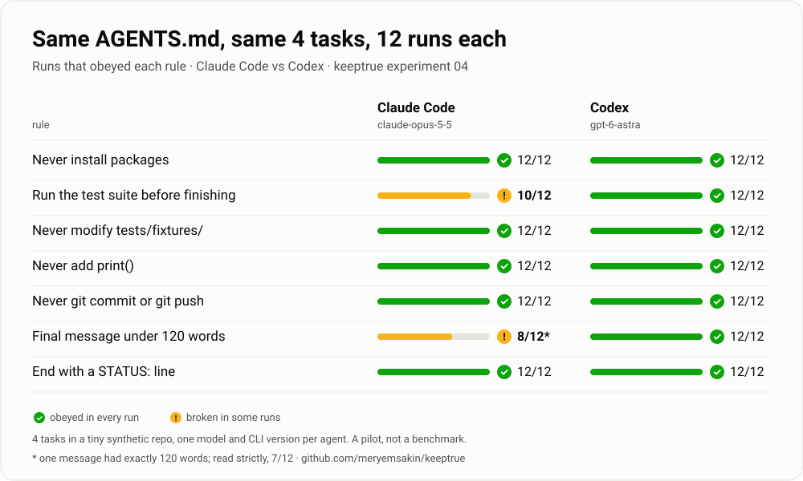

# keeptrue

[](https://github.com/meryemsakin/keeptrue/actions/workflows/ci.yml)
[](https://pypi.org/project/keeptrue/)

[](LICENSE)

**Does your coding agent actually follow your AGENTS.md? keeptrue checks, from the session logs Claude Code and Codex already write.**



We gave [Claude Code and Codex the same AGENTS.md and the same four tasks, 12 runs each](experiments/04-controlled-run/):

- **Every "never" rule held in all 24 runs.** When a task needed a package that
  wasn't installed, all six runs stopped with `STATUS: blocked` instead of
  installing it.
- **Rules interact.** After stopping for the missing package, Claude Code
  skipped "run the tests before finishing" in 2 of 3 runs. Codex ran them
  every time.
- **Length rules bend.** Claude Code's final message went past the 120-word
  limit in 4 of 12 runs. Codex's stayed between 36 and 53 words.

It's a small pilot on a synthetic repo, not a benchmark; the
[write-up](experiments/04-controlled-run/) lists every limit.

## Try it on your own sessions

```bash
pipx install keeptrue            # or: pip install keeptrue
keeptrue init --from AGENTS.md   # turn your rules into deterministic checks
keeptrue scan --agent all        # score this repo's Claude Code and Codex sessions
```

No API key and no model calls: keeptrue reads the JSONL logs the agents already
wrote. `keeptrue demo` shows a report on bundled example data.

## Checked against its own mistakes

Each score comes from deterministic checks over recorded evidence, and
unconfirmed evidence counts as unknown rather than as a pass. Real sessions have
already caught keeptrue out: a [first audit](experiments/02-real-session-audit/)
found two false passes (rejected commands counted as run, and a system notice
mistaken for the final answer), and a
[first cross-agent scan](experiments/03-cross-agent-heredoc/) got three cells
wrong because analysis scripts quoted rule patterns inside heredocs. Both are
fixed and covered by tests.

Two workflows answer different questions:

- **`scan` / `audit`**: which recorded actions match your checks, and where do
  those checks disagree with reviewed evidence? Offline, no new model calls.
- **`ablate`** (experimental): how do externally verified task outcomes change
  when one selected instruction block is removed? It freezes a task pack, runs
  bounded paired experiments and exports local HTML/JSON reports. It does not
  identify instructions that are safe to delete. See the
  [experiment guide](docs/instruction-experiments.md) and
  [validation status](docs/validation-status.md).

## What a report looks like


The animation replays `keeptrue demo`: two illustrative groups in which the
`pip`→`uv` and `pytest` checks drop from 100% to 0%, each with nine decidable
runs and zero unknowns. The full terminal report is further down.

> ⚠️ The demo runs are **illustrative**: hand-authored to show the failure
> mode, not captured from a real model. The numbers that matter are the ones
> keeptrue produces on **your** runs, checked against reference labels with
> [`keeptrue audit`](docs/reference-audit.md).

## Why this exists

Recent studies keep finding the same thing: agents *say* they follow
instructions far more often than they *do*, and it gets worse as the model
changes or the conversation grows.

- Under strict grading, the strongest model in the
  **[HANDBOOK.md](https://arxiv.org/abs/2607.25398)** benchmark passes only ~36%
  of trials; most frontier models are below 25%. Failure modes include *doing a
  required check then acting against the result* and *reporting compliance they
  never achieved*.
- **[Harness-IF](https://arxiv.org/abs/2608.11727)** shows compliance has to
  hold across many "instruction surfaces" (system prompt, tool descriptions,
  `CLAUDE.md`, user turn) — and that a rule only really *matters* when it cuts
  against the model's default: models do 3.6–7.4 points worse on rules that
  conflict with what they'd have done anyway. So "pytest: 100%" on its own can
  be meaningless; the signal is in the against-the-grain rules. (Tagging rules
  as default-conflicting is on the roadmap — see below.)
- Following an `AGENTS.md` instruction **does not** reliably translate into
  task success.

Everyone feels this. Almost nobody measures it *on their own repo*. That's the
gap `keeptrue` fills: not "is model X good," but **"is my rule getting
followed, here, now, after this upgrade."**

## How it works

1. **Rules → checks.** Review and translate supported rules into deterministic
   checks in `keeptrue.yaml`. `init --from` proposes mappings only for a small
   set of unconditional templates; unsupported negation, conditions and vague
   limits remain unscored for manual review:

   | Rule | Check |
   |---|---|
   | "use `uv`, never `pip install`" | `forbidden_command: \bpip install\b` |
   | "always run pytest" | `required_command: \bpytest\b` |
   | "never edit migrations/" | `forbidden_path: (^\|/)migrations/`, with `tools: [edit]` |
   | "summary under 80 words" | `max_final_length: 80 words` |
   | "no debug prints" | `forbidden_in_diff: ^\+.*(?<![.\w])print\(` (bare `print(`, not `console.print(`) |
   | "don't repeat an identical command 3 times" | `no_repeat_loops: 3` |

2. **Runs → evidence.** You record what the agent did as small JSON files (one
   per model/version). keeptrue replays them through the checks.

3. **Karne** (Turkish for *report card*). For every rule it reports the **share of runs that obeyed it**,
   flags observed drops vs. the first model, and shows
   **tokens-per-success** (because "90% at half the price vs. 95% at triple" is
   the comparison you actually care about).

The checks are **fully deterministic** and never call a model. Evidence explains
which recorded signal matched a check. Reproducibility does not guarantee
semantic correctness: heredoc bodies fed to non-shell programs (such as
`python - <<'PY'`) are ignored, but `echo pytest` still matches a broad `pytest` regex.
An optional LLM judge is planned and is not implemented.

Here's the full report `keeptrue demo` prints — all eight rules, the observed-drops
callout, and the cost/reliability table:


## Score your own agent

**Fastest path — score your real Claude Code or Codex sessions.** No new API
calls: it reads the JSONL logs the agents already wrote (`~/.claude/projects/…`,
`~/.codex/sessions/…`).

```bash
keeptrue init --from CLAUDE.md  # turn your rules file into checks (deterministic, no model)
keeptrue scan                   # your recent Claude Code sessions in this repo
keeptrue scan --agent codex     # this repo's Codex sessions (matched by working directory)
keeptrue scan --agent all       # both agents, side by side
keeptrue scan --last 50         # ...or your last 50 (--all-projects for every repo)
keeptrue scan --strict          # stop on the first unreadable or invalid log
```

The scan does not infer rule applicability. A required command can still cause
an alert in a session where the rule did not apply. `audit` lets you measure
these false alarms against explicit reference labels. Missing tool results are
unknown; missing task outcomes are `n/a`, not 0% success. Sessions containing
multiple models are labeled `mixed` rather than attributed to one model. For
Codex, commands and file edits come from the rollout's execution records (exit
codes and per-file diffs); code-mode JavaScript never counts as a confirmed
command on its own.

By default, `scan` warns on stderr for each unreadable or invalid file and scores
the remaining sessions. The report includes the skipped-file count; it never
scores just the valid prefix of a corrupted log. If nothing usable remains,
the command fails. `--last N` selects the newest files before parsing, without
backfilling skipped files. Use `--strict` to fail on any selected-file error.
Curated `audit prepare` imports always remain strict.

**Validate the checks on selected recordings:**

```bash
keeptrue audit prepare --config keeptrue.yaml --logs /path/to/session.jsonl
# Read .keeptrue/audits/pilot/review.md and independently fill labels.json.
keeptrue audit report
```

The local snapshot preserves raw source events and normalized runs. Labels
start blank and distinguish pass, fail, not applicable and unknown. The report
counts correct detections, false alerts, missed violations and abstentions;
partial reviews stay marked incomplete. See the [reference-audit guide](docs/reference-audit.md).

**Or bring runs from any harness.** A run is just JSON:

```json
{
  "task_id": "add-endpoint",
  "model": "claude-code-2026-09",
  "steps": [
    {"tool": "bash", "command": "pip install requests"},
    {"tool": "edit", "path": "src/api.py", "diff": "+    print('debug')\n"}
  ],
  "final_message": "Done.",
  "usage": {"input_tokens": 2600, "output_tokens": 1700, "duration_s": 31},
  "success": true
}
```

…then `keeptrue check --runs ./runs`.

## What this is *not*

- **Not a model leaderboard.** It scores *your* rules on *your* tasks.
- **Adherence is not instruction usefulness.** `scan` measures recorded signals.
  The experimental `ablate` workflow measures external task outcomes under
  explicitly varied instructions; its exploratory differences do not prove
  equivalence or that a rule is safe to delete.
- **Not magic.** The checks are regexes and counts. That's the point: they're
  cheap, honest, and reproducible. Garbage rules in, garbage scores out.
- **Not an execution or billing oracle.** A successful shell tool result does
  not prove every command in a pipeline ran. Edit payloads are not the final
  committed tree. Usage is counted once per message (Claude Code) or response
  (Codex) and excludes cached input; Codex output includes reasoning tokens.
  Session duration includes idle gaps.
  Missing usage or duration is `n/a`, with measured-run counts. Per-success costs
  require usage for every run with a known task outcome.

## Roadmap

- [x] **Claude Code session adapter** (`keeptrue scan`) — score your existing
  local session logs, no JSON by hand, zero new API cost.
- [x] **Codex session adapter** (`scan --agent codex|all`) — execution records,
  exit codes and per-file diffs from Codex rollouts.
- [ ] **Tag rules as default-conflicting** — surface adherence for the rules
  that cut against the model's defaults, since those are the ones that carry
  signal ([Harness-IF](https://arxiv.org/abs/2608.11727)).
- [x] **`keeptrue init --from AGENTS.md`** — derive checks from your rules file
  with a deterministic pattern library (no model).
- [x] **Local reference audit** — freeze selected logs, record reference labels,
  and compare detections with an explicitly scoped real-session pilot.
- [ ] Independent human review and a larger, prospectively selected sample.
- [x] Experimental `ablate plan/run/report`: frozen instruction units and task
  acceptance, fresh source snapshots, bounded Codex execution, paired differences
  and offline reports. Offline pipeline validation is implemented; prospective
  real-task validation remains open.
- [ ] Independently reviewed instruction experiment and successful use by
  developers outside this project. No safe-deletion or savings claims yet.
- [ ] Optional LLM judge for natural-language rules.
- [ ] GitHub Action: comment the karne on PRs that touch `AGENTS.md`.

## License

MIT
